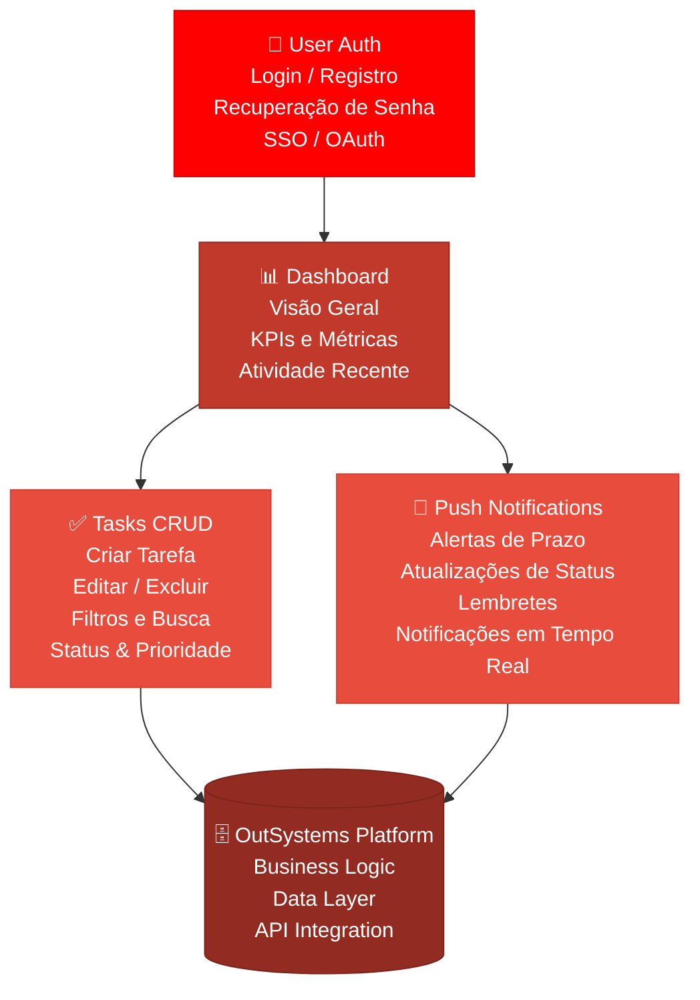
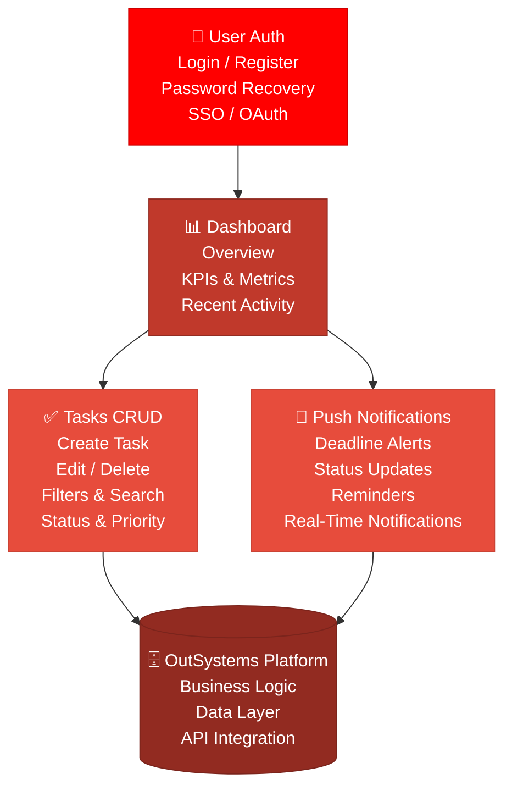

# 📱 DIOGerenciamento — Aplicação Mobile com OutSystems (Aprimorado)

<div align="center">


</div>

---

## 🇧🇷 Português

### 📊 Descrição

Este repositório apresenta a versão aprimorada de uma aplicação mobile de gerenciamento desenvolvida com os princípios e capacidades da plataforma **OutSystems**. O projeto **DIOGerenciamento** expande a versão base com funcionalidades completas de autenticação de usuários, painel de controle, CRUD de tarefas e notificações push — demonstrando o potencial do desenvolvimento low-code para criar aplicações móveis robustas e responsivas para iOS e Android.

### 🏗️ Arquitetura da Aplicação



### 🛠️ Tecnologias Utilizadas

| Tecnologia | Função |
|-----------|--------|
| **OutSystems** | Plataforma low-code para desenvolvimento mobile e web |
| **HTML5** | Estrutura e marcação das telas da simulação |
| **CSS3** | Estilização responsiva e animações da interface |
| **JavaScript** | Lógica de navegação e interatividade do frontend |

### 🚀 Como Usar

1. **Clone o repositório:**
   ```bash
   git clone https://github.com/galafis/Criando-Aplica-o-Mobile-OutSystems-Aprimorado.git
   ```
2. **Navegue até a pasta do projeto:**
   ```bash
   cd Criando-Aplica-o-Mobile-OutSystems-Aprimorado
   ```
3. **Abra o arquivo `src/index.html` no seu navegador** para visualizar a simulação da aplicação mobile com todas as funcionalidades aprimoradas.

### ✨ Funcionalidades Demonstradas

- **Autenticação de Usuários:** Telas de login, registro e recuperação de senha
- **Dashboard:** Painel com visão geral, métricas e atividade recente
- **Gerenciamento de Tarefas (CRUD):** Criar, editar, excluir e filtrar tarefas com status e prioridade
- **Notificações Push:** Alertas de prazo, atualizações de status e lembretes em tempo real
- **Navegação entre telas:** Transições fluidas entre Home, Dashboard e Detalhes
- **Menu lateral responsivo:** Navegação acessível em diferentes tamanhos de tela
- **Carregamento dinâmico de dados:** Simulação de integração com APIs

### 🎯 Competências Demonstradas

- Desenvolvimento low-code com OutSystems
- Arquitetura de aplicações mobile multiplataforma (iOS e Android)
- Design de interfaces responsivas e acessíveis
- Implementação de fluxos de autenticação e autorização
- Gerenciamento de estado e navegação em apps mobile
- Integração de notificações push em aplicações móveis

### Contribuição

Este projeto é parte do portfólio de Gabriel Demetrios Lafis. Sugestões e melhorias são bem-vindas.

### Licença

Este projeto está licenciado sob a Licença MIT. Veja o arquivo `LICENSE` para mais detalhes.

---

## 🇺🇸 English

### 📊 Description

This repository presents the enhanced version of a mobile management application developed using the principles and capabilities of the **OutSystems** platform. The **DIOGerenciamento** project expands on the base version with full user authentication, a control dashboard, Tasks CRUD, and push notifications — demonstrating the potential of low-code development for building robust, responsive mobile applications for both iOS and Android.

### 🏗️ Application Architecture



### 🛠️ Technologies Used

| Technology | Role |
|-----------|------|
| **OutSystems** | Low-code platform for mobile and web development |
| **HTML5** | Structure and markup for simulation screens |
| **CSS3** | Responsive styling and interface animations |
| **JavaScript** | Navigation logic and frontend interactivity |

### 🚀 How to Use

1. **Clone the repository:**
   ```bash
   git clone https://github.com/galafis/Criando-Aplica-o-Mobile-OutSystems-Aprimorado.git
   ```
2. **Navigate to the project folder:**
   ```bash
   cd Criando-Aplica-o-Mobile-OutSystems-Aprimorado
   ```
3. **Open the `src/index.html` file in your browser** to view the enhanced mobile application simulation.

### ✨ Demonstrated Features

- **User Authentication:** Login, registration, and password recovery screens
- **Dashboard:** Overview panel with metrics and recent activity
- **Task Management (CRUD):** Create, edit, delete, and filter tasks with status and priority
- **Push Notifications:** Deadline alerts, status updates, and real-time reminders
- **Screen navigation:** Smooth transitions between Home, Dashboard, and Details
- **Responsive side menu:** Accessible navigation across different screen sizes
- **Dynamic data loading:** Simulation of API integration

### 🎯 Skills Demonstrated

- Low-code development with OutSystems
- Cross-platform mobile application architecture (iOS and Android)
- Responsive and accessible interface design
- Authentication and authorization flow implementation
- State management and navigation in mobile apps
- Push notification integration in mobile applications

### Contribution

This project is part of Gabriel Demetrios Lafis' portfolio. Suggestions and improvements are welcome.

### License

This project is licensed under the MIT License. See the `LICENSE` file for more details.

---

## 📞 Contato | Contact

**GitHub**: [@galafis](https://github.com/galafis)


---

## English

### Overview

📱 DIOGerenciamento — Aplicação Mobile com OutSystems (Aprimorado) - A project built with JavaScript, HTML, CSS, OutSystems, developed by Gabriel Demetrios Lafis as part of professional portfolio and continuous learning in Data Science and Software Engineering.

### Key Features

This project demonstrates practical application of modern development concepts including clean code architecture, responsive design patterns, and industry-standard best practices. The implementation showcases real-world problem solving with production-ready code quality.

### How to Run

1. Clone the repository:
   ```bash
   git clone https://github.com/galafis/Criando-Aplica-o-Mobile-OutSystems-Aprimorado.git
   ```
2. Follow the setup instructions in the Portuguese section above.

### License

This project is licensed under the MIT License. See the [LICENSE](LICENSE) file for details.

---

Developed by [Gabriel Demetrios Lafis](https://github.com/galafis)
